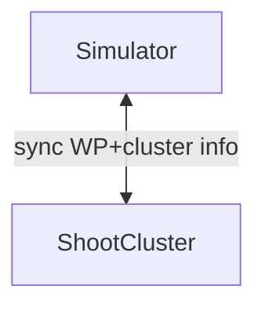

# scaler-simulator
Simulator that determines which worker pool must be scaled to host unschedulable pods

## Goals

1. Advice which worker pool must be extended to host the unschedulable pod(s).
1. Simulate scaling the adviced worker pool and pod scheduling on scaled nodes and compare real-world against simulation.
1. simulation connects to the garden cluster
1. get the worker pool info.
1. synchronizes the cluster info, replicate the same in the simulated cluster. 
1. Lets say there are some unschedulabe pods.
1. then create simulated nodes for all the worker pools.
1. check which node does the simulation scheduler assigns the pod to.
1. print out the worker pool that the node belongs to and say this is the guy that will be scaled.

### Simulator

### TODO: Get Model Info.
1. Use gardenctl to login into project
1. Then exec kubectl to get the shoot.
1. Use gardenct to login to shoot cluster
1. Get exec kubectl to get real nodes and replicate them as fake nodes in simulated api server.

### Simulation Use cases

#### Scale from zero
1. We have two worker groups with n=0, m=2 with machine types: `m5.large`, `m5.2xlarge` respectively.
machine types.

SubCase-A
   1. We will assign a single pods with large request so that it can only fit into `m5.2xlarge`.
   1. The simulation must scale up the second worker group from zero and say pod is assigned to this..

SubCase-B
  1. We will assign a pod with a small request, so it can fit into either node.
  1. The simulation must say that pod is assigned to second node (least waste)

SubCase-C
   1. We will assign a pod with a request that exceeds capacity of existing node in 2nd worker group, but fits for first pool.
   1. The simulation must say that pod is assigned to first node of fist group(least waste)

#### 2 Existing Worker Pools with 1 Node each

First worker pool is tainted with `NoSchedule`.
2 Pod spec are created: one with toleration to the taint and one without. 

SubCase-A
  1. Pod spec that can fit into any node is created with toleration to the taint.
  1. Many replicas of the Pod are deployed which crosses the capacity of node belonging to WP-A
  1. The simulation should scale worker pool-A and assign the Pod to nodes of WP-A (tainted)

SubCase-B (capacity)
   1. More replicas of Pod-A are created whic cannot fit into WP-A max.
   1. The simulation should say max is exceeded, pod replicas remain unschedulable and no other WP should be scaled.

SubCase-C
  1. Pod spec that can fit into any node is created without toleration to the taint. 
  1. Many replicas of the Pod are deployed which crosses the capacity of node belonging to WP-B
  1. The simulation should scale WP-B and assign the Pod to nodes of WP-B (untainted)

#### One Existing Worker Pool with 3 assigned zones 
There is one node started in the first zone.

SubCase-A
1. A Pod with 3 replicas with TSC (maxskew=1) mandating distribution of each replica on separate zone is deployed
1. Simulator should scale Nodes for other zones

### Simple Scale Down of empty node(s). 
We have a worker pool with  started nodes and min-0.

SubCase-A
 1. All Pods are un-deployed.
 1. After `scaleDownThreshold` time, the WP should be scaled down to min.

### Scale Down of un-needed node (STRETCH)
This requires resource utilization computation and we won't do this for now.
Maddy will describe this.

#### WP Out of Capacity  (not possible for now)

There are 2 existing worker pools with different machine types. One machine type (WP-A) is exhausted.

SubCase-A
 1. A Pod with X replicas that is assignable into either WP is deployed.
 1. Simulator should assign Pod to WP-A which

## Setup

1. Ensure you are using Go version above `1.21`. Use `go version` to check your version.
1. Run `./hack/setup.sh`
   1. This will generate a `launch.env` file in the project dir
1. Source the `launch.env` file using command below (only necessary once in term session)
   1. `set -o allexport && source launch.env && set +o allexport`
1. Run the simulation server: `go run cmd/simserver/main.go`
1. The `KUBECONFIG` for simulated control plane should be generated at `/tmp/simulation-kubeconfig.yaml`
   1. `export KUBECONFIG=/tmp/simulation-kubeconfig.yaml`

### Executing within Goland/Intellij IDE

1. Install the [EnvFile](https://plugins.jetbrains.com/plugin/7861-envfile) plugin.
1. There is a run configuration already checked-in at `.idea/.idea/runConfigurations/LaunchSimServer.xml`
   1. This will automatically source the generated `.env` leveraging the plugin
   2. You should be able to execute using `Run > LaunchSimServer`
