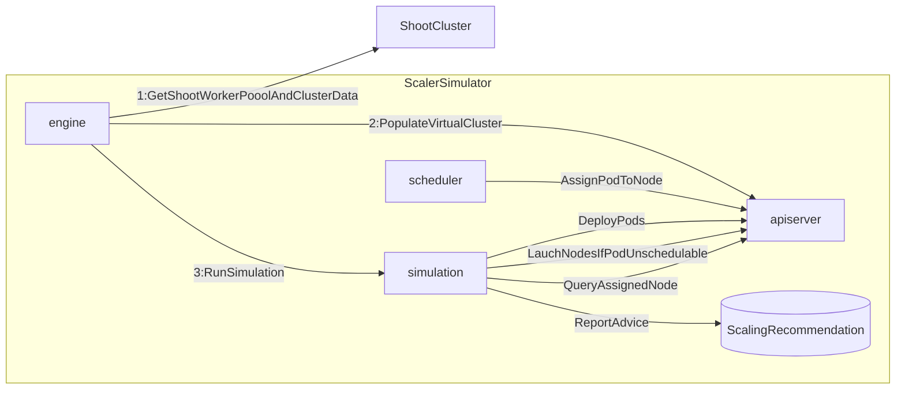

# scaler-simulator

> This project is WIP - DO NOT TRY
 
Scaling Simulator that determines which garden worker pool must be scaled to host unschedulable pods

## Setup

1. Ensure you are using Go version `1.22`. Use `go version` to check your version.
1. Run `./hack/setup.sh`
   1. This will generate a `launch.env` file in the project dir
1. Take a look at generated `launch.env` and change params to your liking if you want.
1. Source the `launch.env` file using command below (only necessary once in term session)
   1. `set -o allexport && source launch.env && set +o allexport`
1. Run the simulation server: `go run cmd/scalesim/main.go`
1. The `KUBECONFIG` for simulated control plane should be generated at `/tmp/scalesim-kubeconfig.yaml`
   1. `export KUBECONFIG=/tmp/scalesim-kubeconfig.yaml`
   1. `kubectl get ns`


### Executing within Goland/Intellij IDE

1. Install the [EnvFile](https://plugins.jetbrains.com/plugin/7861-envfile) plugin.
1. There is a run configuration already checked-in at `.idea/.idea/runConfigurations/LaunchSimServer.xml`
   1. This will automatically source the generated `launch.env` leveraging the plugin
   2. You should be able to execute using `Run > LaunchSimServer`

## Usage


### Op Commands

#### Sync Virtual Cluster with Shoot Cluster

`curl -XPOST localhost:8080/op/sync/<myShoot>`

#### Clear Virtual Cluster

`curl -XDELETE localhost:8080/op/virtual-cluster`

### Scenario Commands

##### Execute Scenario A
`curl -XPOST localhost:8080/scenarios/A`

## Objectives

> TODO: REFINE THE BELOW

Given a garden shoot configured with different worker pools and Pod(s) to be deployed on the shoot cluster: the simulator
will report the following advice:
 1. In case scale-up is needed, the simulator will recommend which worker pool must be scaled-up to host the unschedulable pod(s).
 1. The simulator will recommend which node belonging to which worker pool will host the Pod(s)
 1. ?? Then check will be made against real-shoot cluster on which Pods will be deployed. 
    The simulator's advice will be verified against real-world node scaleup and pod-assignment.

The above will be repeated for different worker pool and Pod specs representing various simulation scenarios 


### Simulator Mechanics

The Simulator works by replicating shoot cluster into its virtual cluster by maintaining its independent copy of 
api server+scheduler. The engine then executes various simulation scenarios.



### Simulation Scenarios

#### Scenario: Simple Scale-from-zero

We have two worker groups with min=1, max=1 with machine types: `m5.large`, `m5.2xlarge` respectively.

```mermaid
graph TB
 subgraph WP-B
  SpecB["machineType: m5.2xlarge\nmin:0,max:1"]
 end
 subgraph WP-A
  SpecA["machineType: m5.large\nmin:1,max:1"]
 end
 ```
##### Step-A
   1. We will assign a single pod with large request so that it can only fit into `WP_B`
   1. The simulation must recommend scale up of `WP_B` group from zero and say pod is assigned to this pool.

##### Step-B
  1. We will deploy a pod with a small request, so it can fit into either node.
  1. The simulation must say that pod is assigned to launched node in `WP_B`

##### Step-C
   1. We will deploy a pod with a request that exceeds current capacity of launched node in `WP_B`, but fits for first pool `WP_A`.
   1. The simulation must advice that pod is assigned to node of fist group `WP_A`.

#### Scenario: Tainted Worker Pools. 


```mermaid
graph TB
 subgraph WP-B
  SpecB["machineType: m5.large\nmin:1,max:2"]
 end
 subgraph WP-A
  SpecA["machineType: m5.large\nmin:1,max:2,Taint:foo=bar:NoSchedule"]
 end
 ```

- First worker pool is tainted with `NoSchedule`.
- 2 Pod spec: X,Y are created: one with toleration to the taint and one without repectively. 

##### Step-A
  1. Replicas of Pod-X are deployed which crosses the capacity of tainted node belonging to `WP-A`
  1. The simulation should advice scaling `WP-A` and assign the Pod to tainted nodes of `WP-A`.

##### Step-B
   1. More replicas of `Pod-X` are created which cannot fit into `WP-A` since it has reached its  max.
   1. The simulator should report `WP-A` max is exceeded, pod replicas remain unschedulable and no other WP should be scaled.

##### Step-C
  1. Many replicas of the `Pod-Y` (spec without toleration) are deployed which crosses the capacity of existing node in   `WP-B`
  1. The simulation should scale `WP-B` and assign the Pod to nodes of `WP-B` 

#### Scenario: Topology Spread Constraints

```mermaid
graph TB
 subgraph WP-A
  SpecB["machineType: m5.large\nmin:1,max:3, zones:a,b,c"]
 end
 ```

One Existing Worker Pool with 3 assigned zones 
There is one node started in the first zone `a`.

`POD-X` has spec with `replicas:3`, `topologySpreadConstraints` with a `maxSkew: 1` and `whenUnsatisfiable: DoNotSchedule`

###### Step-A
1. Deploy `Pod-X` mandating distribution of each replica on separate zone.
1. Simulator should recommend scaling Nodes for zones `b`, `c`

#### Scenario: High Load with large number of Diff Pods

Check out how much time would such a simulation of node scale up take here.
- 400+pods

#### Scenaio: Worker Pool Expansion By Priority 

- Scale up WP in order of priority until max is reached, 
, then move to next WP in priority.
- Analogues our CA priority expander.

PROBLEM:
- We need a better algo than launching virtual nodes one-by-one across pools with priority.
- we need to measure how fast this approach is using
virtual nodes with large number of Pods aand Worker Pools.
- TODO: Look into whether kube-scheduler has  recommendation advice.


#### Scenaio: Workload Redistribution (STRETCH)
- Kerpenter like mechanics


### Simple Scale Down of empty node(s). 
We have a worker pool with  started nodes and min-0.

##### Step-A
 1. All Pods are un-deployed.
 1. After `scaleDownThreshold` time, the WP should be scaled down to min.

### Scale Down of un-needed node (STRETCH)
This requires resource utilization computation and we won't do this for now.

TODO: Maddy will describe this.

#### WP Out of Capacity (STRETCH)
TODO: describe me


### MoM 14th
Vedran's concerns:
- Load with large number of Pods and Pools
- Reduce computational weight when where is a priority expander. Check performance.
- How to determine scheduler ran into error and failed assignment.
- How easy is it to consume the result of the kube-scheduler
in case there is no assigned node.
- machine selector approach may not be computationally scalable ??
  - in order to be computationally feasible we need the
node priiority scores from the scheduler.

